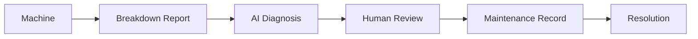

# IndustrialFix AI

AI-assisted industrial maintenance and breakdown diagnosis platform.

> **Status:** In development. This README is updated as features are completed.

## What it does

Maintenance teams register machines, report breakdowns, and receive
AI-generated diagnosis suggestions from a third-party LLM API. Engineers
review each suggestion, then record the actual repair. The AI is a
decision-support tool and never a replacement for engineering judgment.

## Planned workflow

## Tech stack (planned)

- **Frontend:** React, Vite, Tailwind CSS, React Router, Axios
- **Backend:** Node.js, Express
- **Database:** MongoDB, Mongoose
- **Auth:** JWT, bcrypt
- **Validation:** Zod
- **AI:** Third-party LLM API, called only from the backend

## Roadmap

- [x] Phase 1: Repository and planning
- [x] Phase 2: Backend initialization
- [ ] Phase 3: Database and models
- [ ] Phase 4: Authentication
- [ ] Phase 5: Machine management
- [ ] Phase 6: Breakdown management
- [ ] Phase 7: LLM integration
- [ ] Phase 8: AI response validation
- [ ] Later: maintenance, dashboard, testing, deployment

## Author

Sidhant
